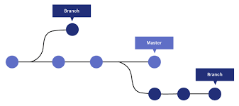

# Git and Github Notes: 
Understanding Git, version control, and Github broken down. 

## Table of Contents
- [What is Git ?](#what-is-git)
- [What is Git used for ?](#what-is-git-used-for)
- [What does Git do ?](#what-does-git-do)
- [How Git works](#what-does-git-do)
- [Getting Started with Git (for mac users)](#getting-started-with-git-for-mac-users)
- [Creating a Project](#working-on-a-team-as-a-developer)
- [Undoing Changes](#how-to-undo-changes)
- [Github Basics](#github)

    

## What is Git ?
- Git is a free and open source version control system. Git is a very popular version control system tool used today. 

## What is Git used for ?
- Git allows developers to track changes in the code. Some changes include:
    - Who made the change ?
    - What changes were made ?
    - When the changes were made ?
- It is also used for **collaborating**. Git allows multiple developers to coordinate work on a project simultaneously. 

## What does Git do ?
- Git **manages** source code 
   
    - How is the source code managed ?
    - It is managed through **Repositories**.
      - A git repository is the .git/ folder inside a project. This folder is hidden. 
      - The git repository tracks all the changes ever made to files in your project.
       - *If you delete the .git/ folder then you delete your projects history*
- **Clone** a project to work on a local copy 
- Control & track changes with **Staging** & **Committing**
- **Branches** & **Merge** to be able to work on different features or parts or versions of a project 
- **Pull** the latest version of a project to a local copy 
- **Push** local updates to the main project
- **Commit** files after each change 
  - Commit can be seen as snapshots in time. *Individual changes to  files, that allows us to see what changes were made when and by who. Always have a message when make a commit. 

  - WORKING DIRECTORY (Project) -----> STAGING AREA(index) -----> COMMITTED CHANGES 
      - **staging area in Git is stored locally on your machine.**
      - **committed changes are officcially saved to repositories history**
## Getting Started with Git for Mac users 
### 1. Download and Install Git from [git-scm](https://git-scm.com/download/mac)
### 2.   Under Binary Installer click on [installer](https://sourceforge.net/projects/git-osx-installer/)
### 3.  Then click on Download 
### 4.   Open file after downlaoding
     - **For mac users Message on the screen will say git was blocked**
     - Watch [Youtube video](https://www.youtube.com/watch?v=O3vtpZgI0fQ) to see how to unblock git and use gitBash on the terminal 
### 5. Check your version of Git on your machine

 ```
    git --version   
```

### 6. Let Git know your name and email 
     - Create an account on [Github](www/github.com)
     - In your terminal configure your name and email so Git knows which name and email to associate with that commit.
        - **In other words you are telling Git who you are**

  - #### Use global to set the name to be the same for every repository 
   ```bash
    git config --global user.name "Your Name"

    //replace "Your Name" with your actual name

    //keep the quotes 

   
  - #### Use global to set the email to be the same for every repository 
    
    git config --global user.email "your.email@example.com"

    //replace "Your.email@example.com" with your actual email

    //keep the quotes 
  
      - Setting a new username for a specific repository:
      - Remove the word ```--global``` if you want to change the name or email for a specific repository:

   
    - #### New Name
    
    git config user.name "Your New Name"
    
    
    - #### New Email
  

    git config user.email "your.new.email@example.com"
    
     ### Why would you not use global ?


      - #### Developers might want to omit the global setting, ```(--global)```, and configure specific settings for a particular repository due to a few reasons:
        - You might want your personal projects to use one identity while your work-related repositories use another. 

        -  Working on projects across various teams or organizations might require different identities
   
### 7. Create a Project to work in 
    - If you already created a folder to work in for your project then navigate it to it using the terminal. 
   
    # make a new directory if you have not created a folder 

    mkdir your_folder_name
  ```

    # change directory 

    cd your_folder_name
    
### 8. Initialize Git

```bash
git init  
```
- The git repository is initialized. This will be an empty git repository
- Git creates a hidden folder  called ```.git``` to keep track of the changes
    


    #### Bonus: How to show the folder in vs code 
- Click on settings
- In search Settings type Exclude to find the default Exclude list 
- Edit ".git" extension to "```.git-s``` " from the list  -> this will allow the .git folder to be visible ad no longer hidden

### 9. Open text editor and add some files

- There is a shortcut to open current working directory in visual studio code
```bash 
#this command will open visual studio code from the terminal
code . 
```
 - Note: This command ```code .```  may not work if the code command is not recognized or added to your system's PATH.
 - Use [Resource](https://docs.newrelic.com/docs/style-guide/writing-docs/writer-workflow/set-up-local/#:~:text=Press%20command%20%2B%20shift%20%2B%20p%20to,that%20file%20in%20VS%20Code.) to assist if you run into this issue 
    
### 10. Working with Files
```bash
#create a new file (you can create files inside integrated terminal in visual studio code, make sure you are working in the bash terminal)

touch "file_name" 
# example touch index.html creates html file 
```

### 11. Check Status of Repository

```bash
#check status of git 
git status

#check status with shorten output
git status --short

#Short Status flags are: 
    # ?? - Untracked (U), These are files that are present in your project directory but haven't been added to the Git repository.
    # A - File are added to stage 
    # M - Modified
    # D - Deleted files 
```
 ### 12. Staging our Files

```bash
#add our files to the staging environment
git add file_name

#or add multiple files at once 
 git add .

 or 

 git add -all
```
#### Notes: 
 - **Untracked Files:**
    -  These are files that are present in your project directory but haven't been added to the Git repository.
     - Git doesn't recognize these files and doesn't track changes in them.
    - They won't be included in commits until you explicitly add them to the staging area.

-   **Modified  Files:**
    -  These are files that have been changed since the last commit.directory but haven't been added to the Git repository.
     - Git recognizes these files as part of the repository and tracks the changes made to them.
    - They're in the working directory and are marked as modified because they've been edited **but not staged for a commit.**


-   **Added Files:**
    -  These are files that have been modified and then explicitly added to the staging area (using ```git add```).
     - Git recognizes these files as part of the repository and tracks the changes made to them.
    - They're in the working directory and are marked as modified because they've been edited **but not staged for a commit.**
 

 ### 13. ### Committing our Files 
- moving from staging to committing files
- Adding commits keeps track of our progress and changes, as we work 
- In Git each commit is seen as a snapshot of our project. We can use these snapshots to revert to earlier versions when we need to. 

```bash
git commit -m "message"

git commit -am "message" 
#add and commit at the same time
 ```

13. ### Commit Log 

```bash
#git log allows us to see all of the commits that were made in the project

git log 

# see commits for that specific file 
git log <file_name>

#Git shows the commit history for the specified file, along with the differences (patch) for each commit. 
git log - p <file_name>


#command shows the revision and author information for each commit in a file
git blame <file_name>

```

14. #### Getting Help 
```bash 
#git help gives us a list of common Git commands used in various situations:
git help

#gives us all git commands
git help - a;

# it shows you the differences between what's in your files right now and what Git knows about. 
git diff 
```
```bash
esc key : wq click enter 
#to escape anf get back to terminal

```

## Gitignore Files 
- In Git, the .gitignore file tells Git which files or directories to ignore when tracking changes in a project.

# Working on a Team as a Developer 
 - When working on projects it is important to know how git works when collaborating with other developers.

 ### 1. Creating a Branch 
  - Think of a **branch as an independent workspace where you can add, modify, and delete files without affecting the files in other branches.**
 
  - It is recommended not to work in the master/main branch. 
      - The master or main branch often represents the stable, deployable version of your project for most companies. 
      - Once your work is completed, tested, and reviewed, you merge it back into the master or main branch.
      - ***Changes made in one branch don't affect other branches until explicitly merged.***

      

      ```bash 
      #Lists all existing branches and highlights the current branch.

      git branch
      ```

      ```bash
      #Creates a new branch.
      git branch <branch_name>
      ```

      ```bash 
      #lists all the branches
      git branch -av
      ```

      ```bash 
      #switching from one branch to another 
      
      git checkout <branch_name> 
      
      or 
      # Switches to a different branch.
      git switch <branch_name>

      #The git checkout command doesn't bring the changes from one branch to another directly. Instead, it switches your working directory and the state of your files to match the selected branch.
      ```
      
    # Deleting a branch 
      - There may be times when you want to delete a branch in your project 

      ```bash
      #Delete a Merged Branch: Use -d flag. This deletes the specified branch only if it has been fully merged into its upstream branch.

       git branch -d branch_name
      ```

      ```bash 
      #Force Delete an Unmerged Branch: Use -D flag. This deletes the specified branch regardless of its merge status. Lead to permanent data loss if you delete an unmerged branch.
      
      git branch -D <branch_name>
      ```

      ```bash 
      git checkout branch_name 
      
      then
      
      git branch -d branch_name

      #Remember when you are deleting a branch you can not be inside the branch. use bash checkout command to switch branch. 
      
      ```

    # Merging Branches 
      - Merging branches in Git means combining changes from one branch into another. 

      - ## The master/main branch should never have bugs in it. It should be conflict free with no bugs

      - It is better to merge the master branch into the feature branch in order to mitigate bugs and reduce th chance of breaking the code. 

      - Then when it is free of conflicts you can merge a feature branch into the master  


    ```bash 
    #the terminal command to merge branches

    git merge branch_name
    ```
     - Key Note: The branch you want to merge into you must be inside of it first
          
        -Ex: If I am in the feature_branch and I want to merge into the **main** branch I need to checkout to the **main** branch 
       
        ```bash
        # Fist I must switch to the main branch 

         git checkout main
           then 
           # I can run the merge command
          
        git merge feature_branch
          
          # Now I have merged the feature_branch into the main branch
          ```
     ### Viewing Merge History 

      ```bash 
      ## View commit history with a graphical representation of branches and merges
      git log --oneline --graph
      ```

    # Merge Branch Conflicts 
     - Merge conflicts occur when Git is unable to automatically merge changes from different branches. This typically happens when changes have been made to the same part of a file in both branches being merged

     - Real Life Scenario:
      ```bash
      Imagine you are working on a school writing group project and you and your partner, Sarah, are both editing the same word in a specific paragraph. 

      Ex: The dog went to the store 
        - You edit the third word in this sentence to "ran"
        - Sarah edits the third word in this sentence to "hurried". 
      ```
      ```bash
        - Your Edit: "The dog ran to the store."
        - Sarah's Edit: "The dog hurried to the store."

       Both words "ran" and "hurried" can not exist at the same time as the third word in this sentence. This will cause a Conflict. 

      As teammates you and Sarah will have to decide what will be the third word. As you both have made conflicting changes to the same part of the sentence, a merge conflict would arise. This is the same in git merge conflicts.   
    ```

 ### Merge Conflict Markers 
  ```bash 
    - The <<<<<<<, =======, and >>>>>>> markers are called conflict markers in Git. 
    <<<<<<< HEAD: This marker indicates the beginning of the conflicting changes from the current branch (HEAD refers to the latest commit on the current branch).

=======: This marker separates the conflicting changes from the current branch (HEAD) and the changes from the branch being merged.

>>>>>>> BranchName: This marker indicates the end of the conflicting changes and specifies the branch from which the conflicting changes originate. In the example, BranchName is the name of the branch that you are merging into the current branch.
```

## CODE EXAMPLE:
 - master branch, side bar branch

 ```bash
<<<<<<< HEAD
    <aside>
        <h2>helllo this is the sidebar</h2>
        <footer>copyrights shariya george</footer>
    </aside>
=======
    <ol>
        <li>one </li>
        <li>two </li>
        <li>three </li>
    </ol>
>>>>>>> master

# everything that is after (=====) this is code coming from the master branch 
```
- Key Note: You will decide what section of code you wan to be deleted from what branch ot to merge both


# How to Undo Changes 

```bash 
#undo changes made in branch

git checkout -- file_name 
#this will undo the changes that were done in the file. This command will replace the file in your working directory with the version from the last commit.
```

```bash 
git reset --hard HEAD

# Undo all the changes between HEAD and the commit and discard ALL THE CHANGES !!

# In Git, HEAD is a special pointer or reference that points to the latest commit in the branch you are currently on

#REMEMBER:
-  This will get rid of all current changes in your project and sets it back to the last saved version (commit) on your branch. 
-  Use this command carefully, IT  WILL permanently erases any uncommitted work.
```
## Go back in Time with Git reset - 
- If you think that you lost your project or lost your work you can go back in time with git 
    
    ``` bash 
    git reset --hard (specified commit)
    
    #this will do the same thing only difference is with this command you have to specify what commit you want it to reset to 

    #the HEAD will now be at the commit has you placed as your specified commit 
    ```
 
  ```bash
     EX:  git reset --hard ASKDJFH3J40403003
  
    #This command resets your branch to the commit with the hash ASKDJFH3J40403003

    #When you perform a git reset --hard to a specific commit, it resets your branch to that commit, and any commits that came after that commit will be removed.

    #The commits are listed in reverse chronological order, with the most recent commit at the top.
   
   ```

### Git Revert 

```bash 
 git revert (commit-hash)
```
  - Git revert is a selective undo button 

  - Allows you to undo specific changes introduced by a commit without discarding the entire commit or rewriting history. 

  - This can be especially useful when you want to maintain a clean and transparent history, particularly in collaborative environments.
  
  
# Github 
- Create Login 
- Create Repository 
- Name Repository 
- Decide to make public or private 
- Add READ.ME file or .gitignore file if one is not created already
- Push ```git push``` our local Repo to Github 

## How do we go from Github to Git
 ### Cloning a Repository 
 - The git clone command is used to create a copy of a remote Git repository on your local machine. 

- We are going to click on code 
- Clone the project
- Copy HTTPS link 
- Type ```git clone```then paste link 
  - make sure your repository is in the correct directory/ folder that you want 

  ```bash 
   git clone link (folder_name)
      
   ```
  Clone an Existing Repository:

# If you're starting a project from scratch, you don't need to initialize a new repository locally. Instead, you can clone an existing repository from a remote location, such as GitHub.
Cloning a repository creates a copy of the repository on your local machine and sets up the necessary Git configuration and remote tracking for you.
Initialize Git (if necessary):

# If you're not cloning an existing repository but starting a project from scratch, you need to initialize a new Git repository locally in the project directory. This step sets up Git for version control in that directory.
  ## Pushing Code to Github Clone an Existing Repository:

git clone <repository_URL>
Initialize Git (if necessary):
git init

---------------------------------------------
  - private or public repository is based on the nature of your project 

  - You can add gitignore file manually 

  - Click create repository 

  ```bash 
  - in the gitignore file we include anything you want to ignore 
    
  #In Git, the .gitignore file is used to specify intentionally untracked files and directories that Git should ignore.
  example: 

  # Ignore images folder
    images/ 

  #This rule tells Git to ignore the entire "images" directory and its contents.
  
   ```

   ## Git remote, Git pull 
  - Remote Repository: The repository hosted on GitHub's servers.

 - Local Repository: The copy of the  repository on your local machine.

    "origin" Remote: 
- The default name given to the remote that points to the GitHub repository you cloned from.

- Using the git remote command, you can manage this connection between your local repository and the GitHub repository, allowing you to collaborate with others and synchronize your work.

```bash 
 git remote add <name> <url>

 ```

# Push your local project to a private repository on GitHub, you can follow these steps:
## Initialize Git in Your Local Project:
## Navigate to your project directory and initialize Git if you haven't already.


cd /path/to/your/project
git init
Add Your Files to the Repository:
Add all your project files to the staging area.


git add .
Commit Your Changes:
Commit the files with an appropriate commit message.


git commit -m "Initial commit"
Add the Remote Repository:
Add the URL of your GitHub repository as a remote repository. Replace <username> with your GitHub username and <repository> with the name of your private repository.

sh
Copy code
git remote add origin https://github.com/<username>/<repository>.git
Push Your Changes:
Push your committed changes to GitHub. If this is the first push to a new repository, you might need to set the upstream branch.

sh
Copy code
git push -u origin main
Note: If your default branch is master instead of main, use master instead of main in the command above.

Authenticate:
If prompted, enter your GitHub username and password or personal access token for authentication. GitHub has moved to using personal access tokens instead of passwords for Git operations.

Here’s a summarized version of the commands:

sh
Copy code
cd /path/to/your/project
git init
git add .
git commit -m "Initial commit"
git remote add origin https://github.com/<username>/<repository>.git
git push -u origin main
Note: Ensure your GitHub repository is private when you create it, if that is your preference. You can change this setting in the repository's settings on GitHub.

Generating a Personal Access Token
If you haven't already created a personal access token, follow these steps:

Go to GitHub and log in.
Click on your profile icon in the top right corner and go to Settings.
In the left sidebar, click Developer settings.
Click Personal access tokens.
Click Generate new token.
Select the scopes or permissions you'd like to grant this token.
Click Generate token at the bottom of the page.
Copy the token and save it somewhere secure. You'll use this token as your password when performing Git operations.

 ### Git Pull 
 - It's a combination of two other Git commands: git fetch and git merge.

 - Imagine you have a folder on your computer where you're working on a project using Git. This folder is like your "local" workspace.

- Now, let's say you're collaborating with others on this project, and they've made some changes to the project that you want to include in your version. These changes are stored in a "remote" location, like GitHub.

- So, when you run git pull, it's like reaching out to that remote location (like GitHub), grabbing any new changes made by your collaborators, and bringing them into your local workspace. It's like updating your local version of the project to match the latest version that everyone's been working on.

- ## In simple terms: git pull gets the latest updates from the remote location (like GitHub) and merges them into your local version of the project. It's a way to keep your project up-to-date with changes made by others.

```bash 
git pull origin <branch>

#If you want to pull changes from the default branch (usually "main" or "master"), you can omit the <branch> part.
```


 
### Created By: @RiyaDevelops

 
